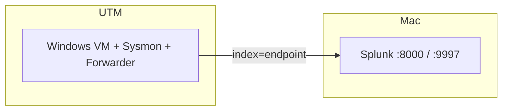

# Splunk SOC Detection Lab

Home lab project: get Windows logs into Splunk, simulate a few attacks, write detections, set up alerts, and write up what happened.

I'm on an **M2 Mac with 8 GB RAM**, so the setup is a bit different from the usual two-VM guides — Splunk runs on the Mac directly, and I have one **Windows 11 ARM** VM in UTM for the endpoint.

Full writeup in [`docs/`](docs/README.md).

---

## Setup

---

## Docs

| Phase | What |
|---|---|
| [0](docs/phase-0-preparation.md) | Figuring out if my Mac could even run this |
| [1](docs/phase-1-environment.md) | Splunk, VM, Sysmon, forwarder (most of the debugging) |
| [2](docs/phase-2-baseline-dashboard.md) | SOC Overview dashboard |
| [3](docs/phase-3-attack-simulation.md) | Running the attack scripts |
| [4](docs/phase-4-detections.md) | SPL saved searches |
| [5](docs/phase-5-alerting.md) | Alerts + Triggered Alerts |
| [6](docs/phase-6-incident-report.md) | Incident writeup |

---

## Alerts I configured

| Alert | MITRE | Type |
|---|---|---|
| Brute Force | T1110.001 | Scheduled, 5 min |
| Encoded PowerShell | T1059.001 | Real-time |
| Suspicious Outbound | T1071.001 | Real-time |
| Registry Run Key | T1547.001 | Scheduled, 1 min |

---

## Other projects

- [VPC Lab](https://github.com/TamiDeji04/VPC-LAB)
- [Automated Cloud Incident Response](https://github.com/TamiDeji04/Automated-Cloud-Incident-Response-VPC-EXT)
