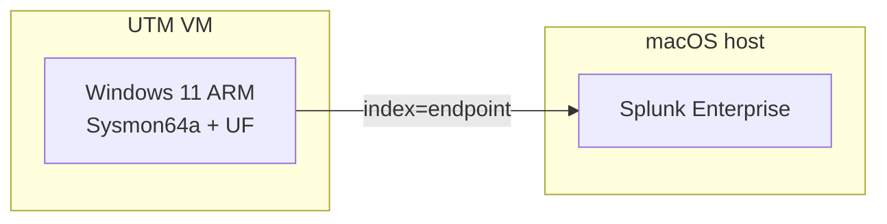

# Splunk SOC Detection Lab

A hands-on endpoint detection and incident response lab built on **Splunk Enterprise**, **Sysmon**, and **MITRE ATT&CK**-mapped attack simulations. Splunk runs natively on an Apple M2 Mac; a **Windows 11 ARM** VM in **UTM** generates the telemetry.

This repo documents **alerting** (Phase 5) and the **incident report** (Phase 6) for a four-technique attack chain: brute force, encoded PowerShell, web beaconing, and registry persistence.

---

## Architecture

Built for **Apple Silicon** — one VM instead of two, Splunk on the host instead of an Ubuntu VM, `Sysmon64a` instead of x64 Sysmon.

---

## Documentation

| Phase | Guide |
|---|---|
| 5 | [Alerting — detections to Triggered Alerts](docs/phase-5-alerting.md) |
| 6 | [Incident Report — full attack chain](docs/phase-6-incident-report.md) |

Full doc index: [`docs/README.md`](docs/README.md)

---

## What this demonstrates

- SIEM log onboarding (Security + Sysmon → `index=endpoint`)
- Detection engineering with MITRE ATT&CK IDs
- Scheduled and real-time alerting with validation
- Tier 1-style incident documentation
- Real troubleshooting (Sysmon `errorCode=5`, VM clock skew, alert trigger syntax)

---

## Key alerts

| Alert | MITRE | Type | Severity |
|---|---|---|---|
| Brute Force Password Guessing | T1110.001 | Scheduled (5 min) | High |
| Encoded PowerShell Execution | T1059.001 | Real-time | Critical |
| Suspicious Outbound | T1071.001 | Real-time | Medium |
| Registry Run Key | T1547.001 | Scheduled (1 min) | High |

---

## Related projects

- [VPC Lab](https://github.com/TamiDeji04/VPC-LAB)
- [Automated Cloud Incident Response](https://github.com/TamiDeji04/Automated-Cloud-Incident-Response-VPC-EXT)
