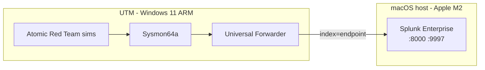

# Splunk SOC Detection Lab — Documentation

Hands-on Windows endpoint detection and incident response using Splunk Enterprise, Sysmon, and Atomic Red Team techniques on Apple Silicon (M2 Mac + UTM).

---

## Phases

| Phase | Document | Status |
|---|---|---|
| 5 | [Alerting](phase-5-alerting.md) | Complete — detections converted to alerts, validated in Triggered Alerts |
| 6 | [Incident Report](phase-6-incident-report.md) | Complete — simulated attack chain documented |

Earlier phases (environment setup, baseline dashboard, attack simulation, detections) were completed in the lab; Phase 7 will add full repo documentation for Phases 0–4 when published to GitHub.

---

## Architecture

---

## Key resources

| Resource | Value |
|---|---|
| Splunk index | `endpoint` |
| Splunk receiver | `:9997` |
| Target VM | `WIN-K1DGK4BA0UM` |
| Sysmon service | `sysmon64a` (ARM64) |
| MITRE techniques | T1110.001, T1059.001, T1071.001, T1547.001 |

---

## Screenshots

All Phase 5 and Phase 6 figures live in [`screenshots/`](screenshots/README.md).

---

## Related projects

- [VPC Lab](https://github.com/TamiDeji04/VPC-LAB)
- [Automated Cloud Incident Response](https://github.com/TamiDeji04/Automated-Cloud-Incident-Response-VPC-EXT)
