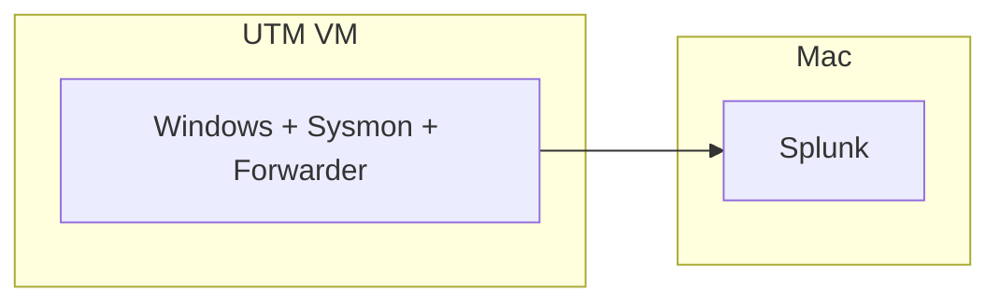

# Phase 0: Preparation

I'm on an M2 Mac with 8 GB of RAM. Most Splunk lab guides assume you have an Intel PC, 16 GB RAM, and two virtual machines. That is not what I had.

I started with about 20 GB free on my internal drive (later got it up to ~73 GB). Splunk itself is only a couple GB, but the Windows VM and ISO eat a lot more — I was budgeting around 30 GB for the VM alone.

---

## What I did

I ran `df -h` on my Data volume to see what I actually had left. Then I listed out what needed to fit:

| Thing | Rough size |
|---|---|
| Splunk on macOS | ~2 GB |
| Windows 11 ARM ISO | ~5 GB |
| UTM VM | ~30 GB (grows over time) |

I installed **UTM** for the VM and **CrystalFetch** to build a Windows 11 ARM ISO. Regular VirtualBox + x64 Windows was not going to work on Apple Silicon, and I did not have the disk space for a second Linux VM just to host Splunk anyway.

When Splunk and the VM were both running, I closed Chrome and anything else heavy. 8 GB goes fast.

---

## Why I changed the setup

Every guide I found wanted Ubuntu + Splunk in one VM and Windows in another. On my Mac that was a non-starter — not enough RAM, not enough disk.

So I ran Splunk **directly on macOS** (Splunk 10 supports Apple Silicon now) and kept **one** Windows 11 ARM VM for the endpoint. That was the whole lab:

Not the textbook layout, but it was what actually fit my machine.

---

Next: [Phase 1 — Environment Setup](phase-1-environment.md) · [docs index](README.md)
