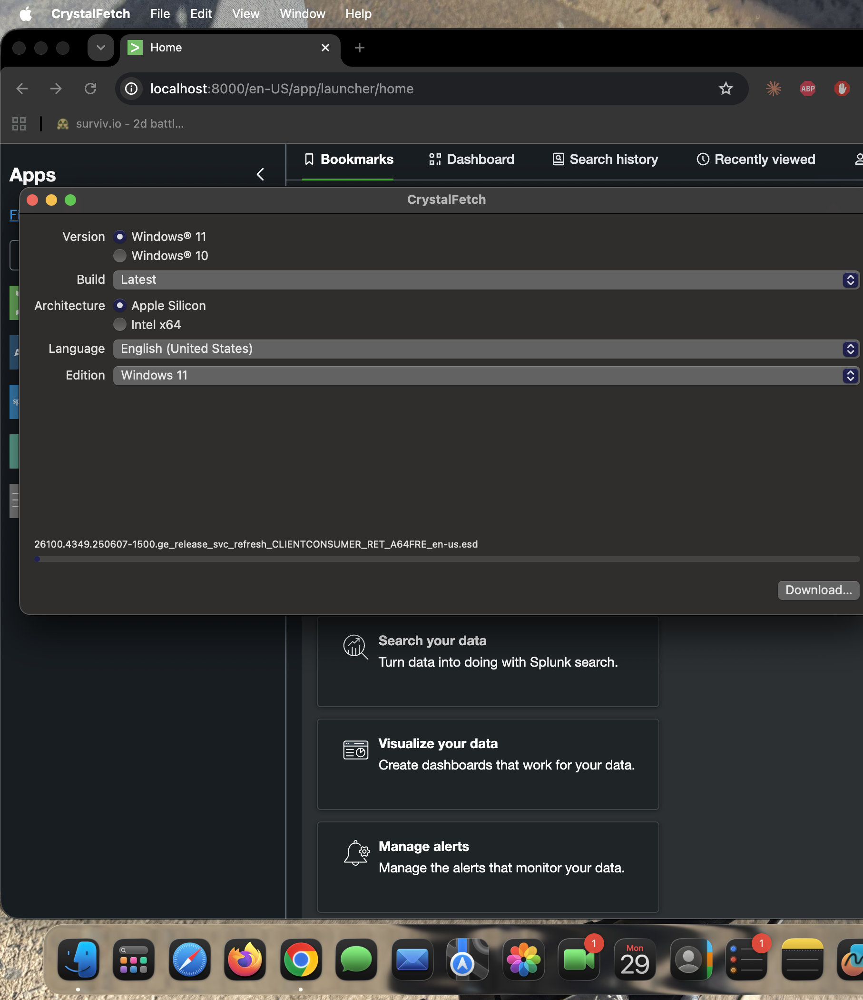
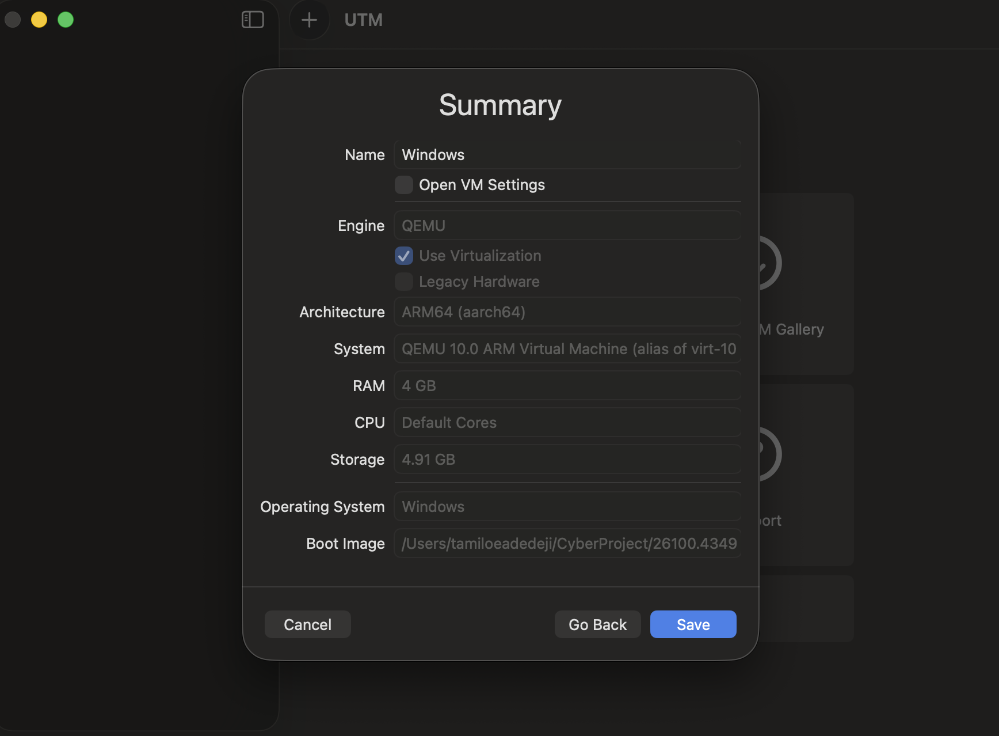
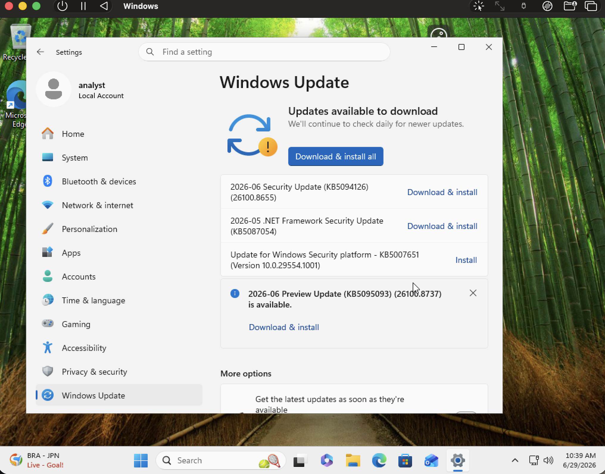
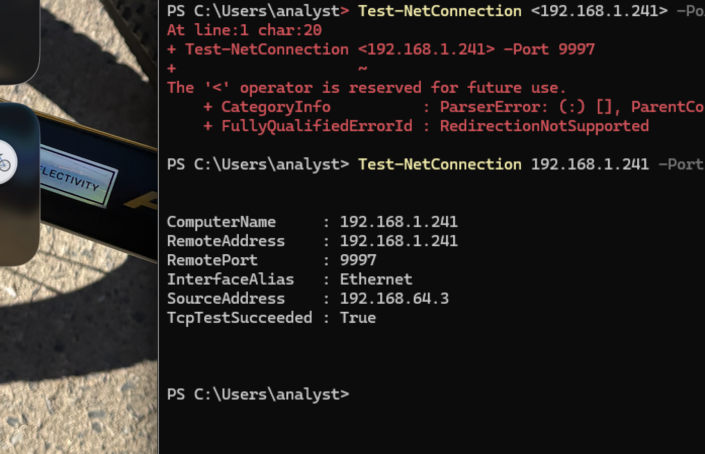
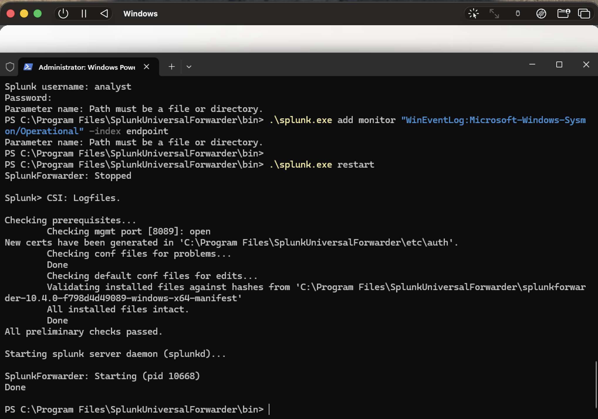
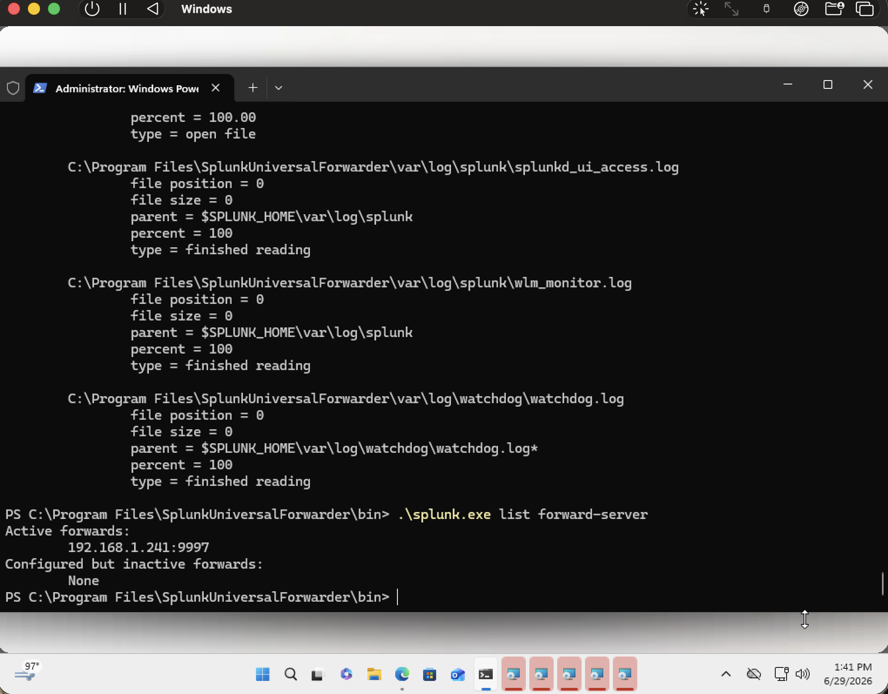
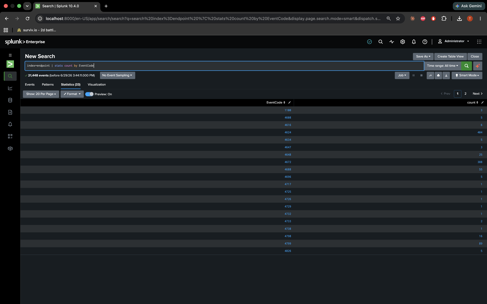

# Phase 1: Environment Setup

This phase took the longest. I was trying to get logs from a Windows VM into Splunk on my Mac — Security events, Sysmon, the works. A lot of stuff broke along the way.

**Final setup:**

| Piece | Details |
|---|---|
| Splunk | macOS, `localhost:8000`, receiving on `:9997` |
| Index | `endpoint` |
| VM name | `WIN-K1DGK4BA0UM` |
| Mac IP (for forwarder) | `192.168.1.241` |
| Sysmon | `sysmon64a` (ARM version) |
| Forwarder | Splunk UF 10.4.0, x64 build running under emulation |

---

## Splunk on the Mac

I signed up on splunk.com, downloaded Splunk Enterprise for macOS, and installed it.

```bash
cd /Applications/Splunk/bin
sudo ./splunk start --accept-license
```

In the web UI I:

- Created an index called `endpoint` (Settings → Indexes → New Index)
- Turned on receiving on port `9997` (Settings → Forwarding and receiving → **Receive data** — not the forwarding tab, I mixed those up at first)
- Installed the **Microsoft Sysmon** and **Microsoft Windows** add-ons from Splunkbase and restarted

The add-ons are what let you search fields like `EventCode` and `CommandLine` instead of raw XML blobs.

---

## Windows VM in UTM

I used CrystalFetch to download/build a Windows 11 ARM ISO:



Then I made the VM in UTM — 4 GB RAM, shared networking, attached the ISO:



Installed Windows with a local account (`analyst`), ran updates:



I needed to confirm the VM could actually talk to Splunk on my Mac:

```powershell
Test-NetConnection 192.168.1.241 -Port 9997
```



First time I wrapped the IP in `< >` like the guide showed and PowerShell threw an error. Removing the brackets fixed it.

I took a snapshot of the clean VM before installing anything else.

---

## Sysmon

I installed Sysmon64a (the ARM build — regular Sysmon did not work) with the SwiftOnSecurity config ([`scripts/sysmon/sysmonconfig-export.xml`](../../scripts/sysmon/sysmonconfig-export.xml) in this repo):

```powershell
$workDir = "C:\Windows\Temp\Sysmon"
New-Item -ItemType Directory -Force -Path $workDir | Out-Null
Invoke-WebRequest -Uri "https://download.sysinternals.com/files/SysinternalsSuite-ARM64.zip" -OutFile "C:\Windows\Temp\SysInternals.zip"
Expand-Archive "C:\Windows\Temp\SysInternals.zip" $workDir -Force
Copy-Item C:\Lab\sysmon\sysmonconfig-export.xml $workDir\sysmonconfig.xml   # or download from repo
& "$workDir\Sysmon64a.exe" -accepteula -i "$workDir\sysmonconfig.xml"
```

Sysmon logs process creation, network connections, registry changes — stuff the normal Windows Security log does not give you in a useful way. Most of my later searches depended on it.

---

## Universal Forwarder

No ARM forwarder exists for Windows, so I installed the x64 UF and hoped emulation would handle it (it did).

```powershell
cd "C:\Program Files\SplunkUniversalForwarder\bin"
.\splunk.exe set servername WIN-K1DGK4BA0UM
.\splunk.exe add forward-server 192.168.1.241:9997 -method clone
```

I tried `splunk add monitor` for the Sysmon log first. That was wrong — it wants file paths, not event log channels:



What actually worked was editing `inputs.conf`:

```ini
[WinEventLog://Security]
disabled = 0
index = endpoint

[WinEventLog://Microsoft-Windows-Sysmon/Operational]
disabled = 0
index = endpoint
renderXml = true
```

Restarted the forwarder and checked it was pointed at the Mac:




---

## The big problem: Sysmon not showing up in Splunk

Security events showed up fine. I could search `EventCode=4625` and get results. Sysmon was a different story — `EventCode=1` returned nothing even though Sysmon was clearly running on the VM.

I ran `index=endpoint | stats count by source` and only saw `WinEventLog:Security`. No Sysmon.

The forwarder looked fine in `list inputstatus`, so I dug into `splunkd.log` and found this:

```
Could not subscribe to 'Microsoft-Windows-Sysmon/Operational': errorCode=5
```

errorCode 5 = access denied. The service account could read Security but not Sysmon.


Fix that actually worked:

```powershell
Stop-Service SplunkForwarder
sc.exe config SplunkForwarder obj= "LocalSystem"
Start-Service SplunkForwarder
```

Plus `renderXml = true` on the Sysmon input, and deleting the Sysmon checkpoint file so it re-read old events:

```powershell
.\splunk.exe stop
Remove-Item "C:\Program Files\SplunkUniversalForwarder\var\lib\splunk\modinputs\WinEventLog\*Sysmon*" -Force -ErrorAction SilentlyContinue
.\splunk.exe start
```

After that Sysmon events finally showed up. This ate a lot of time — the forwarder said it was healthy the whole time.

---

## VM clock was wrong

Another thing that messed me up: searches for "last 15 minutes" returned nothing, but "all time" had data. The VM clock was off from my Mac.

```powershell
w32tm /resync /force
```

Once the clocks matched, recent time ranges started working.

---

## Proof it worked

```spl
index=endpoint earliest=-15m
| stats count by EventCode
```

I wanted to see Security codes (4624, 4625) and Sysmon codes (1, 3, 13) in the same table. This screenshot is from when I only had Security events — before the Sysmon fix:



Once Sysmon was fixed, the same search showed both. That was the moment the pipeline actually felt real.

---

Next: [Phase 2 — Baseline Dashboard](phase-2-baseline-dashboard.md) · [Phase 0](phase-0-preparation.md)
