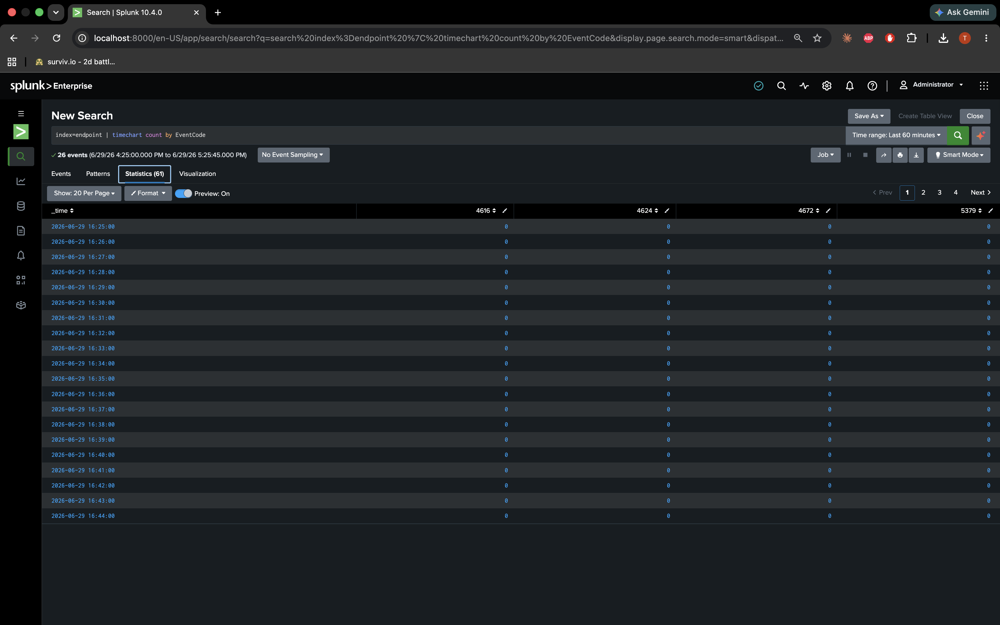
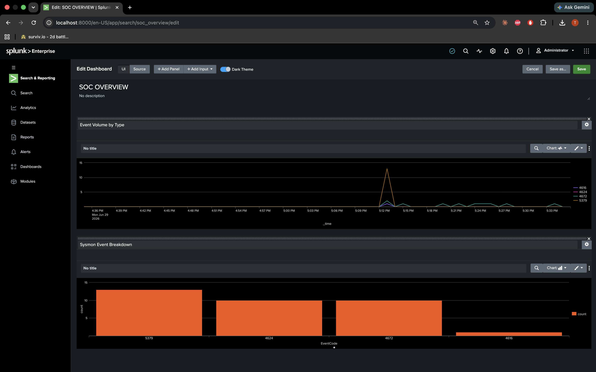
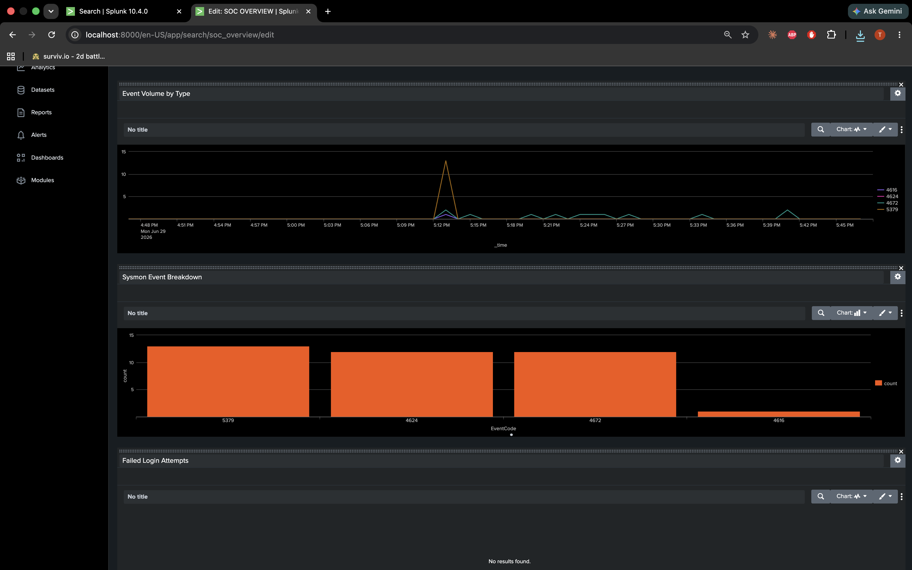

# Phase 2: Baseline Dashboard

Before running attacks I wanted a normal picture of what this VM looked like in Splunk. Mostly so I'd notice when something changed.

I built a dashboard called **SOC Overview** with a few basic searches.

---

## Searches I used

Failed logons:

```spl
index=endpoint EventCode=4625
| timechart count
```

Process activity (I stuck with EventCode at first because `Image` / `ParentImage` were not always populated until Sysmon parsing was working):

```spl
index=endpoint EventCode=1
| stats count by ParentImage, Image
```

Network connections:

```spl
index=endpoint EventCode=3
| stats count by Image, DestinationIp, DestinationPort
```

Overall volume:

```spl
index=endpoint
| timechart count by EventCode
```



---

## The dashboard

I saved those as panels and put them on one dashboard — event volume chart, a bar chart of event types, and a failed login panel.





Before any attacks, the interesting stuff was mostly normal logon events (4624, 4672) and some VM noise like clock changes (4616). The failed login panel was empty, which made sense — nothing bad had happened yet.

---

## What I learned here

I tried searching `Image="*powershell.exe"` early on and got zero results even though I knew PowerShell had run. Turned out Sysmon was not in Splunk yet (the errorCode=5 issue). Once that was fixed, the same fields worked.

Also — dashboards are just easier to show someone than running four separate searches. Same data, one screen.

---

Next: [Phase 3 — Attack Simulation](phase-3-attack-simulation.md) · [Phase 1](phase-1-environment.md)
