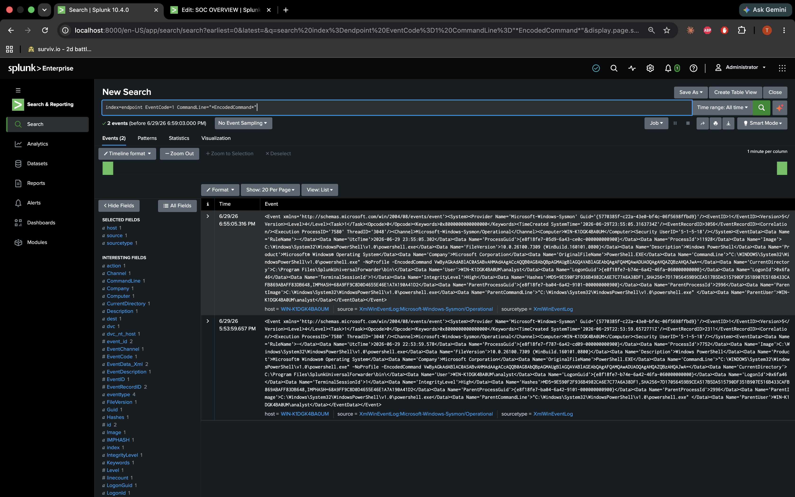
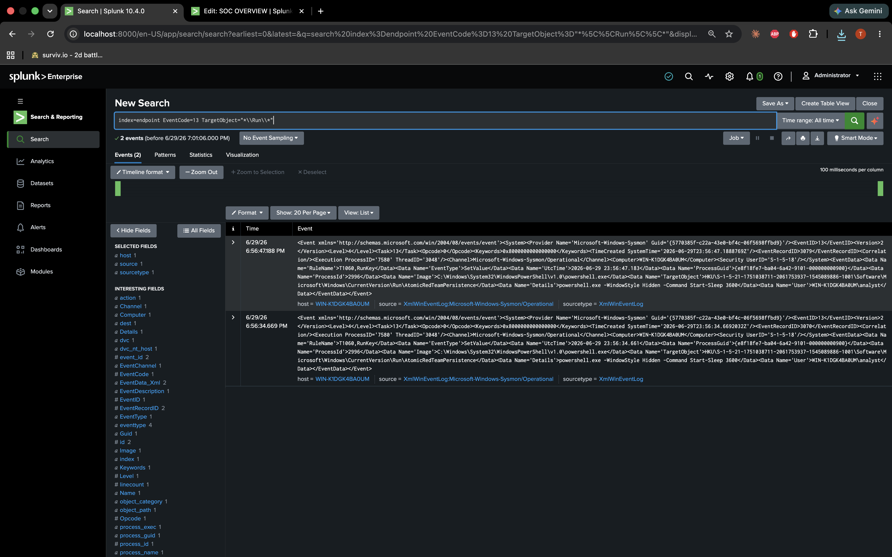
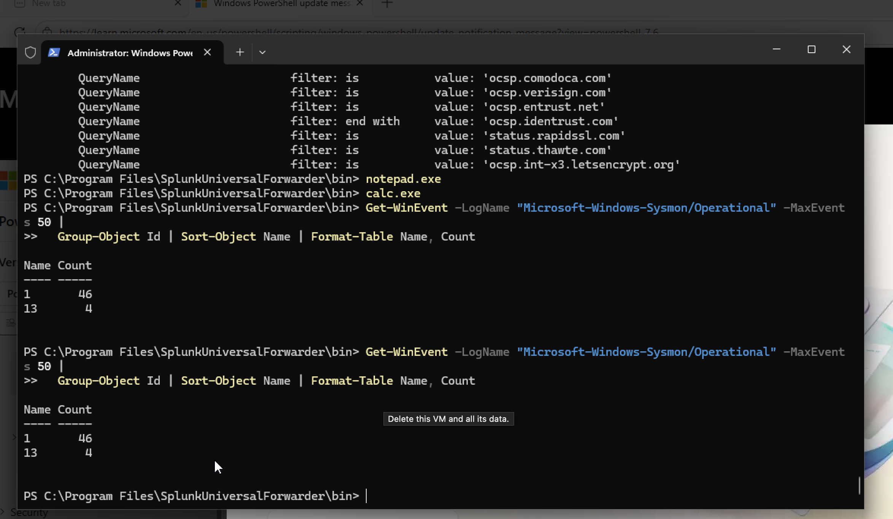

# Phase 3: Attack Simulation

This is where I actually ran stuff on the VM to generate suspicious logs. Four techniques, all mapped to MITRE IDs because that's how the detections and alerts are labeled later.

I snapped the VM first so I could roll back if I broke something.

| MITRE | What I ran | What showed up in logs |
|---|---|---|
| T1110.001 | Fake logon attempts | Security event 4625 |
| T1059.001 | Encoded PowerShell | Sysmon event 1 |
| T1071.001 | HTTP requests in a loop | Sysmon event 3 |
| T1547.001 | Registry Run key | Sysmon event 13 |

I skipped credential dumping (T1003) — too much AV hassle for a home lab.

---

## Brute force (T1110.001)

```powershell
1..12 | ForEach-Object {
  $p = ConvertTo-SecureString "WrongPass$_!" -AsPlainText -Force
  $cred = New-Object System.Management.Automation.PSCredential("baduser", $p)
  Start-Process cmd.exe -Credential $cred -ErrorAction SilentlyContinue
  Start-Sleep -Milliseconds 400
}
```

The logins fail on purpose. Each failure still creates a 4625 in the Security log.

```spl
index=endpoint EventCode=4625
```


---

## Encoded PowerShell (T1059.001)

```powershell
$cmd = "Write-Host 'AtomicRedTeam T1059 test'"
$enc = [Convert]::ToBase64String([Text.Encoding]::Unicode.GetBytes($cmd))
powershell.exe -NoProfile -EncodedCommand $enc
```

```spl
index=endpoint EventCode=1 CommandLine="*EncodedCommand*"
```



---

## Web beacon (T1071.001)

```powershell
1..6 | ForEach-Object {
  Invoke-WebRequest "http://www.example.com" -UseBasicParsing | Out-Null
  Start-Sleep 3
}
```

```spl
index=endpoint EventCode=3 Image="*powershell.exe"
```


---

## Run key persistence (T1547.001)

```powershell
Set-ItemProperty -Path "HKCU:\Software\Microsoft\Windows\CurrentVersion\Run" `
  -Name "AtomicRedTeamPersistence" `
  -Value "powershell.exe -WindowStyle Hidden -Command Start-Sleep 3600" -Force
```

```spl
index=endpoint EventCode=13 TargetObject="*\\Run\\*"
```



---

## Quick check on the VM itself

When Splunk looked empty I'd check Sysmon locally first:

```powershell
Get-WinEvent -LogName "Microsoft-Windows-Sysmon/Operational" -MaxEvents 50 | Group-Object Id
```



If events exist on the VM but not in Splunk, it's a forwarder problem — not the attack script.

---

Next: [Phase 4 — Detections](phase-4-detections.md) · [Phase 2](phase-2-baseline-dashboard.md)
