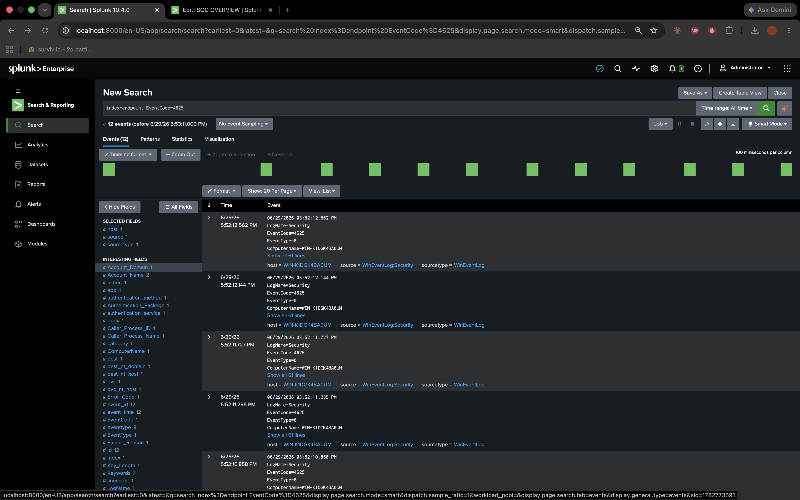
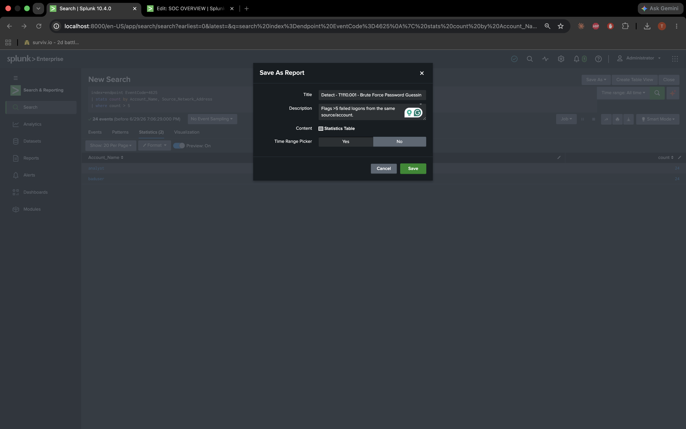
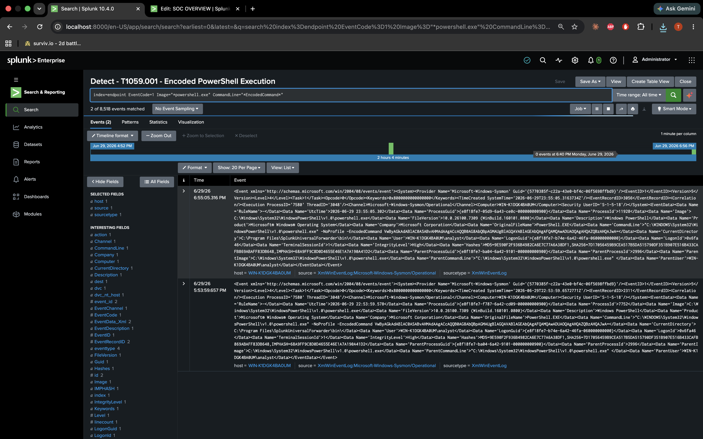
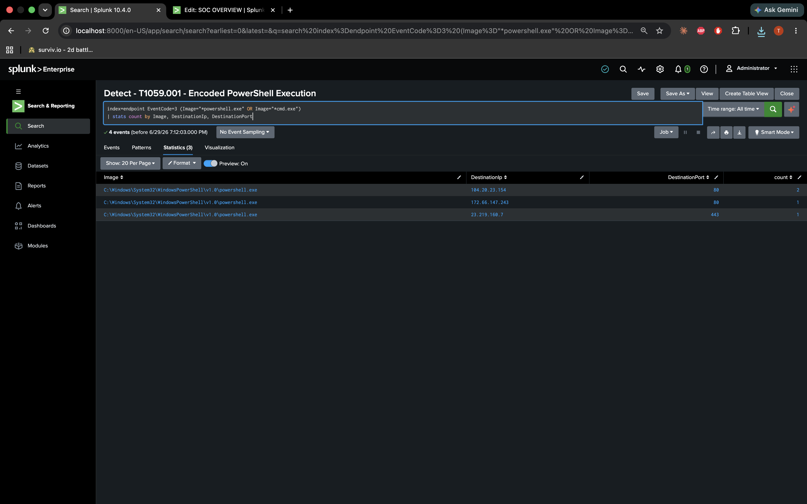
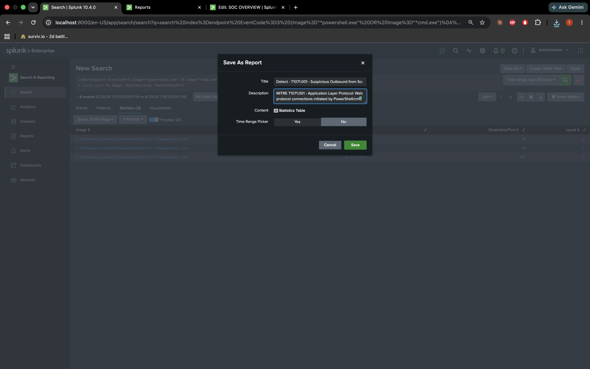
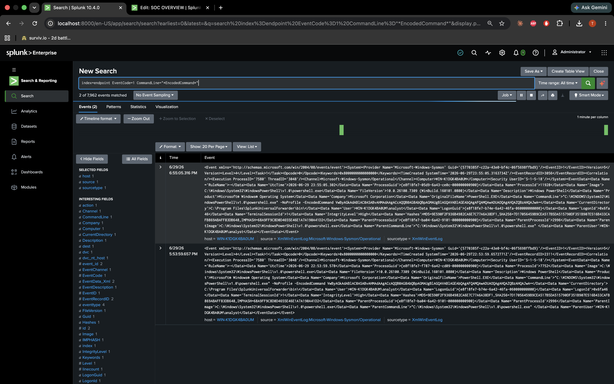

# Phase 4: Detections

After the attacks worked, I wrote SPL searches to catch each one and saved them as reports in Splunk. These are what I turned into alerts in Phase 5.

| Report name | MITRE |
|---|---|
| Detect - T1110.001 - Brute Force Password Guessing | T1110.001 |
| Detect - T1059.001 - Encoded PowerShell Execution | T1059.001 |
| Detect - T1071.001 - Suspicious Outbound | T1071.001 |
| Detect - T1547.001 - Registry Run Key | T1547.001 |

I put the MITRE ID in each description field so I'd remember what the search was for.

---

## Brute force

```spl
index=endpoint EventCode=4625
| stats count by Account_Name, Source_Network_Address
| where count > 5
```

Picks up more than 5 failed logons from the same place. I used 5 because my test script did 12 attempts — not a magic number, just worked for the lab.





---

## Encoded PowerShell

```spl
index=endpoint EventCode=1 Image="*powershell.exe" CommandLine="*EncodedCommand*"
```



`-EncodedCommand` is a common red flag. This one felt obvious enough to alert on immediately.

---

## Suspicious outbound

```spl
index=endpoint EventCode=3 (Image="*powershell.exe" OR Image="*cmd.exe")
| stats count by Image, DestinationIp, DestinationPort
```





---

## Registry Run key

```spl
index=endpoint EventCode=13 TargetObject="*\\Run\\*"
```



Caught the `AtomicRedTeamPersistence` key from my test script.

---

## Thing that tripped me up

For a while `Image` and `CommandLine` searches returned nothing. I thought my SPL was wrong. It wasn't — Sysmon just wasn't in Splunk yet. After the forwarder fix in Phase 1, the same queries started returning hits without me changing them.

---

Next: [Phase 5 — Alerting](phase-5-alerting.md) · [Phase 3](phase-3-attack-simulation.md)
