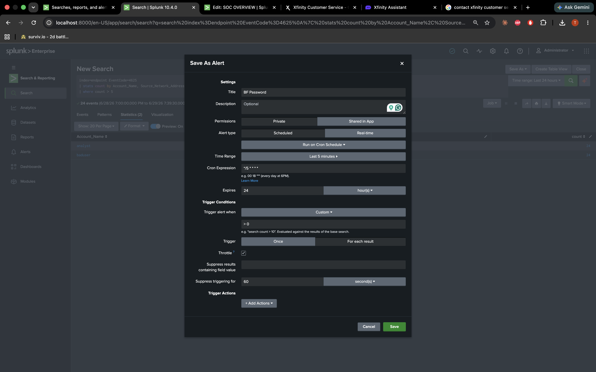
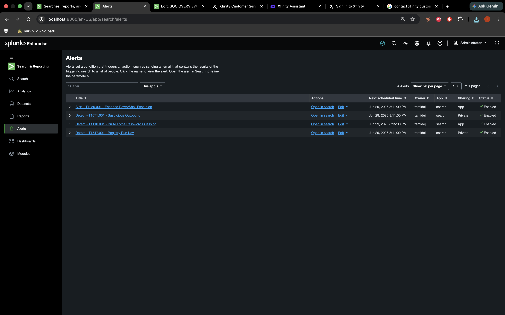
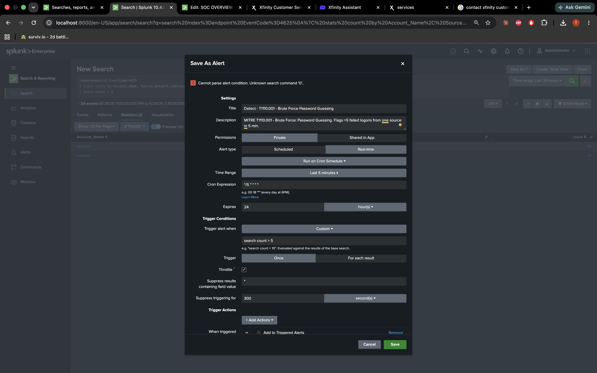
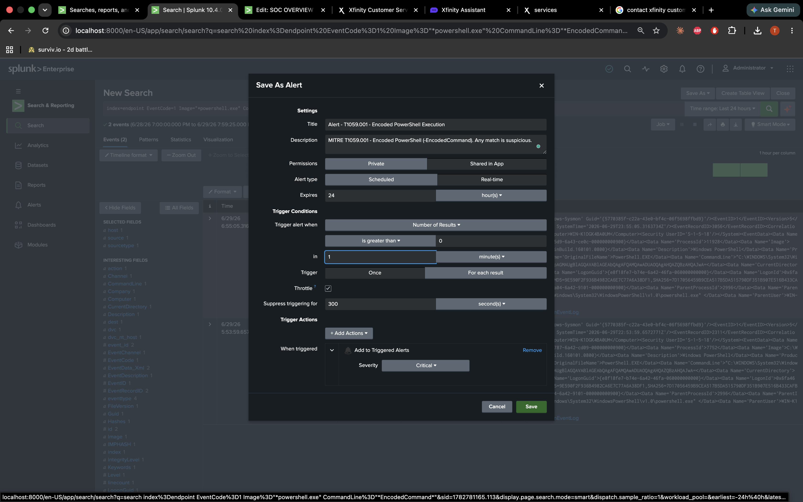
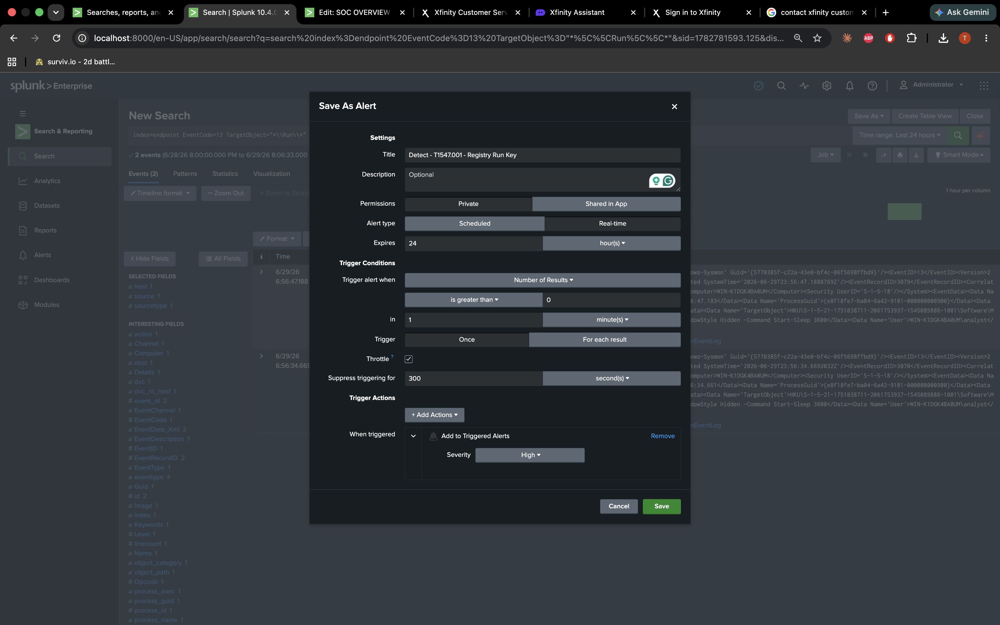
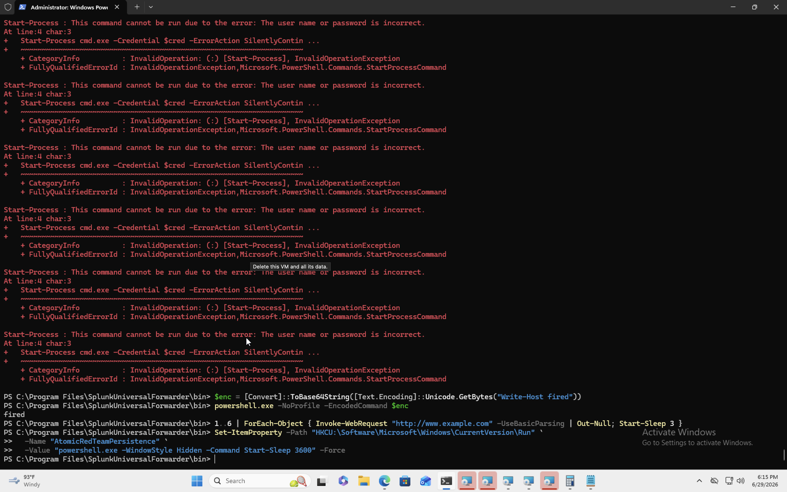
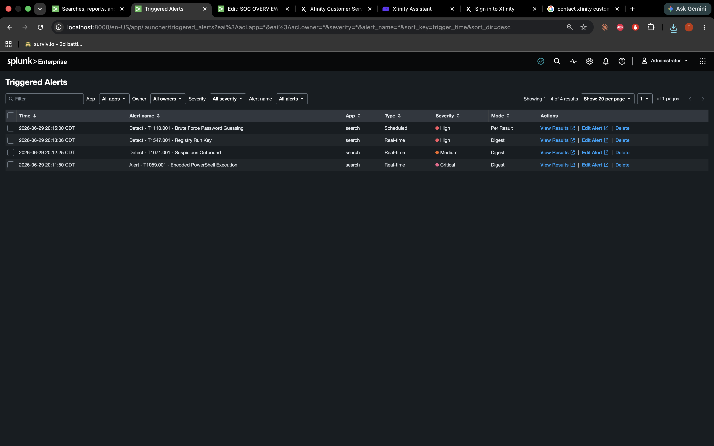

# Phase 5: Alerting

Up through Phase 4 I had detections — saved SPL searches that returned results when I ran them manually. Phase 5 is where those searches become something an analyst would actually work from: **alerts** that fire on their own and land in Splunk's **Triggered Alerts** queue.

That distinction matters. A detection you have to remember to run is a hunting query. An alert that fires when conditions are met is operational security. Tier 1 SOC work is mostly the second thing: acknowledge, investigate, escalate or close.

I built this lab on Splunk Enterprise's **60-day trial**, which still includes scheduled and real-time alerting. After the trial converts to the Free license, alerting goes away — so I made sure to configure, test, and screenshot everything in this phase while it still worked.

---

## What I started with

By the time I got to alerting, I had:

- Splunk Enterprise running natively on my Mac (Apple M2, 8 GB RAM)
- A Windows 11 ARM VM in UTM (`WIN-K1DGK4BA0UM`) forwarding into `index=endpoint`
- Sysmon64a plus the SwiftOnSecurity config on the VM
- Four saved detections tagged with MITRE ATT&CK IDs:
  - **T1110.001** — Brute Force Password Guessing
  - **T1059.001** — Encoded PowerShell Execution
  - **T1071.001** — Suspicious Outbound from Scripting Engine
  - **T1547.001** — Registry Run Key Persistence
- A **SOC Overview** dashboard with baseline panels

The goal for Phase 5: convert those detections into alerts, re-run the attack simulations, and prove all four showed up under **Activity → Triggered Alerts**.

---

## Roadblocks before alerting could work

Alerting was the last step, but most of the pain happened earlier in the pipeline. If I had skipped straight to alerts without fixing these, every alert would have looked broken even when the logic was fine.

### Sysmon never reached Splunk (errorCode=5)

This was the big one.

**What I saw:** Windows Security events showed up fine — I could search `index=endpoint EventCode=4625` and get failed logon bursts. Sysmon was a different story. Searches like `index=endpoint EventCode=1` returned nothing, even though Sysmon was clearly running on the VM. Locally, `Get-WinEvent` showed dozens of Event ID 1 process-creation records.

**How I narrowed it down:**

1. On the Mac: `index=endpoint | stats count by source` — only `WinEventLog:Security` appeared. No Sysmon channel at all.
2. On the VM: `splunk.exe list inputstatus` showed `splunk-winevtlog.exe` running with ~19 MB shipped and no error — so the forwarder looked healthy.
3. On the VM: grepping `splunkd.log` for Sysmon finally gave the answer:

```
WinEventLogChannel::subscribeToEvtChannel: Could not subscribe to
Windows Event Log channel 'Microsoft-Windows-Sysmon/Operational': errorCode=5
```

**errorCode=5 is Access Denied.** The Universal Forwarder could read the Security log but did not have permission to subscribe to the Sysmon Operational channel.


**Fix:**

1. Run the forwarder service as **Local System** (not a restricted virtual service account):

```powershell
Stop-Service SplunkForwarder
sc.exe config SplunkForwarder obj= "LocalSystem"
Start-Service SplunkForwarder
```

Note the space after `obj=` — `sc.exe` requires it.

2. Set the Sysmon input to XML rendering in `inputs.conf`:

```ini
[WinEventLog://Microsoft-Windows-Sysmon/Operational]
disabled = 0
index = endpoint
renderXml = true
```

3. Reset the WinEventLog checkpoint so existing Sysmon events get re-read:

```powershell
.\splunk.exe stop
Remove-Item "C:\Program Files\SplunkUniversalForwarder\var\lib\splunk\modinputs\WinEventLog\*Sysmon*" -Force -ErrorAction SilentlyContinue
.\splunk.exe start
```

After that, `index=endpoint source="*Sysmon*"` populated with EventCodes 1, 3, and 13. The Splunk Add-on for Microsoft Sysmon could finally parse fields like `Image`, `CommandLine`, and `TargetObject`.

**Lesson:** A forwarder that is "up" and shipping bytes is not the same as a forwarder that is subscribed to every channel you care about. Validate per source, not just per index.

---

### VM clock skew

**What I saw:** Searches over "Last 15 minutes" or "Last 60 minutes" returned empty. "All time" showed plenty of data. I spent a while thinking Sysmon or field extraction was broken when it was mostly a timestamp problem.

**Fix:** On the VM:

```powershell
Set-Service w32time -StartupType Automatic
Start-Service w32time
w32tm /resync /force
```

Compared `Get-Date` on the VM to the Mac menu bar clock until they matched.

**Why it matters for alerting:** Scheduled and real-time alerts evaluate recent time windows. Events indexed with the wrong `_time` land outside those windows and alerts never fire — silently.

---

### Wrong Splunk screen for port 9997

**What I saw:** Splunk rejected `9997` with *"specified in incorrect format. Please specify in host:port form."*

**Cause:** I was on **Configure forwarding** (outbound), not **Configure receiving** (inbound). The indexer only needs a port number; the forwarder on the VM needs `192.168.x.x:9997`.

**Fix:** Settings → Forwarding and receiving → **Receive data** → Configure receiving → New → port `9997`.

---

### Alert trigger syntax error

**What I saw:** Red banner when saving an alert: *"Cannot parse alert condition. Unknown search command '0'."*

**Cause:** I used **Custom** trigger with `> 0` in the condition box instead of the built-in **Number of Results** option.



**Fix:** Trigger alert when **Number of Results** → **is greater than** → `0`. The SPL search already applies the real logic (`where count > 5` for brute force); the alert just needs to know "did this search return any rows?"

---

### Brute force simulation noise

When re-running the T1110.001 simulation, some `Start-Process -Credential` calls failed in PowerShell with *"The user name or password is incorrect."* That is expected — I was using fake credentials against a non-existent `baduser` account. Each failure still generated **Event 4625** in the Security log, which is what the detection counts. This lab simulates password guessing via failed logon events, not a full RDP brute-force against a remote service.

---

## The four detections (recap)

Before turning anything into an alert, I confirmed each saved search returned hits against real attack telemetry.

### T1110.001 — Brute Force

```spl
index=endpoint EventCode=4625
| stats count by Account_Name, Source_Network_Address
| where count > 5
```

Twelve failed logons against `baduser` from the local source (`::1` / loopback in the stats table).


Saved as **Detect - T1110.001 - Brute Force Password Guessing**:


---

### T1059.001 — Encoded PowerShell

```spl
index=endpoint EventCode=1 Image="*powershell.exe" CommandLine="*EncodedCommand*"
```

Sysmon Event 1 with `-EncodedCommand` in the command line — the classic obfuscation flag.


---

### T1071.001 — Suspicious Outbound

```spl
index=endpoint EventCode=3 (Image="*powershell.exe" OR Image="*cmd.exe")
| stats count by Image, DestinationIp, DestinationPort
```

PowerShell making outbound connections to external IPs on ports 80 and 443 after the beacon simulation.


---

### T1547.001 — Registry Run Key

```spl
index=endpoint EventCode=13 TargetObject="*\\Run\\*"
```

Sysmon Event 13 showing `AtomicRedTeamPersistence` under the user's Run key, with the SwiftOnSecurity rule name `T1060,RunKey` in the raw event.


---

## Converting detections to alerts

I opened each saved search and used **Save As → Alert**. All four ended up enabled under **Settings → Searches, reports, and alerts → Alerts**.



### Alert 1: Brute Force — Scheduled

Brute force is a **volume** problem over a time window, so this one is **scheduled**, not real-time.

| Setting | Value |
|---|---|
| Title | `Detect - T1110.001 - Brute Force Password Guessing` |
| Description | MITRE T1110.001 — Brute Force: Password Guessing. Flags >5 failed logons from one source in 5 min. |
| Permissions | Shared in App |
| Alert type | Scheduled |
| Cron schedule | `*/5 * * * *` (every 5 minutes) |
| Time range | Last 5 minutes |
| Trigger | Number of Results **> 0** |
| Trigger mode | Once |
| Throttle | 300 seconds, suppress by `Source_Network_Address` |
| Action | Add to Triggered Alerts |
| Severity | High |



**Why scheduled:** The search aggregates failures before deciding. Real-time would fire on every single 4625; the scheduled run lets the `stats ... | where count > 5` logic evaluate the full window.

---

### Alert 2: Encoded PowerShell — Real-time

A single encoded PowerShell execution is high-fidelity enough to alert immediately.

| Setting | Value |
|---|---|
| Title | `Alert - T1059.001 - Encoded PowerShell Execution` |
| Description | MITRE T1059.001 — Encoded PowerShell (-EncodedCommand). Any match is suspicious. |
| Alert type | Real-time |
| Trigger | Number of Results **> 0** in **1 minute** |
| Throttle | 300 seconds |
| Action | Add to Triggered Alerts |
| Severity | Critical |



---

### Alert 3: Registry Run Key — Scheduled (1 minute)

| Setting | Value |
|---|---|
| Title | `Detect - T1547.001 - Registry Run Key` |
| Alert type | Scheduled, every 1 minute |
| Trigger | Number of Results **> 0** |
| Severity | High |



---

### Alert 4: Suspicious Outbound — Real-time

| Setting | Value |
|---|---|
| Title | `Detect - T1071.001 - Suspicious Outbound` |
| Alert type | Real-time |
| Severity | Medium |

This one fired in Triggered Alerts alongside the others after the attack re-run.

---

## Validation — making the alerts fire

Detections and alert configs mean nothing until you prove the full loop: **attack → log → search → alert → triage queue**.

I re-ran all four simulations in the VM (Admin PowerShell):

```powershell
# T1110.001 — brute force
1..12 | ForEach-Object {
  $p = ConvertTo-SecureString "WrongPass$_!" -AsPlainText -Force
  $cred = New-Object System.Management.Automation.PSCredential("baduser",$p)
  Start-Process cmd.exe -Credential $cred -ErrorAction SilentlyContinue
  Start-Sleep -Milliseconds 400
}

# T1059.001 — encoded PowerShell
$enc = [Convert]::ToBase64String([Text.Encoding]::Unicode.GetBytes("Write-Host fired"))
powershell.exe -NoProfile -EncodedCommand $enc

# T1071.001 — web beacon
1..6 | ForEach-Object { Invoke-WebRequest "http://www.example.com" -UseBasicParsing | Out-Null; Start-Sleep 3 }

# T1547.001 — Run key persistence
Set-ItemProperty -Path "HKCU:\Software\Microsoft\Windows\CurrentVersion\Run" `
  -Name "AtomicRedTeamPersistence" `
  -Value "powershell.exe -WindowStyle Hidden -Command Start-Sleep 3600" -Force
```



Then on the Mac: **Activity → Triggered Alerts**.

All four alerts appeared within about five minutes:

| Time (CDT) | Alert | Type | Severity |
|---|---|---|---|
| 20:15:00 | Detect - T1110.001 - Brute Force Password Guessing | Scheduled | High |
| 20:13:06 | Detect - T1547.001 - Registry Run Key | Real-time | High |
| 20:12:25 | Detect - T1071.001 - Suspicious Outbound | Real-time | Medium |
| 20:11:50 | Alert - T1059.001 - Encoded PowerShell Execution | Real-time | Critical |



**Note on timing:** The real-time alerts showed up first (encoded PowerShell at 20:11:50). The brute force alert appeared last at 20:15:00 because it runs on a **five-minute cron** — it waits for the next scheduled slot even if the attack happened a minute earlier. That is normal for scheduled alerts and worth knowing when you are triaging: a delay does not mean the detection failed.

---

## Tier 1 triage workflow

When an alert fires in a real SOC, the rough order is:

1. **Acknowledge** it in Triggered Alerts so the queue reflects someone is looking.
2. **Open the contributing events** — Splunk links the alert to the raw logs that triggered it.
3. **Pivot with broader searches** — widen the time range, check the same host for other EventCodes, look for follow-on activity (4624 after 4625, outbound connections after encoded PowerShell).
4. **Decide:** false positive (tune threshold or suppress), benign admin activity, or escalate to Tier 2 / incident response.

Phase 6 documents that investigation path as a formal incident report for this simulated chain.

---

## What I would tune next

- **Brute force threshold:** `count > 5` worked for a lab with a deliberate burst. Production would baseline per account type and probably add risk scoring instead of a flat number.
- **4624 correlation:** After a 4625 burst, search for a successful **4624** on the same host — that is the "they got in" moment.
- **Notification actions:** I used **Add to Triggered Alerts** only. Email or Slack would be the next step in a real environment.
- **Run key allowlisting:** Any new `\Run\` value is suspicious in this lab; production would need exclusions for legitimate software installers.

---

## Checkpoint

- [x] Four detections saved with MITRE IDs in descriptions
- [x] Four alerts configured (two real-time, two scheduled)
- [x] All four alerts fired after attack re-run
- [x] Screenshots captured (config + Triggered Alerts)
- [x] Completed during Enterprise trial (alerting still enabled)

Next: [Phase 6 — Incident Report](phase-6-incident-report.md)

Back to [documentation index](README.md).
